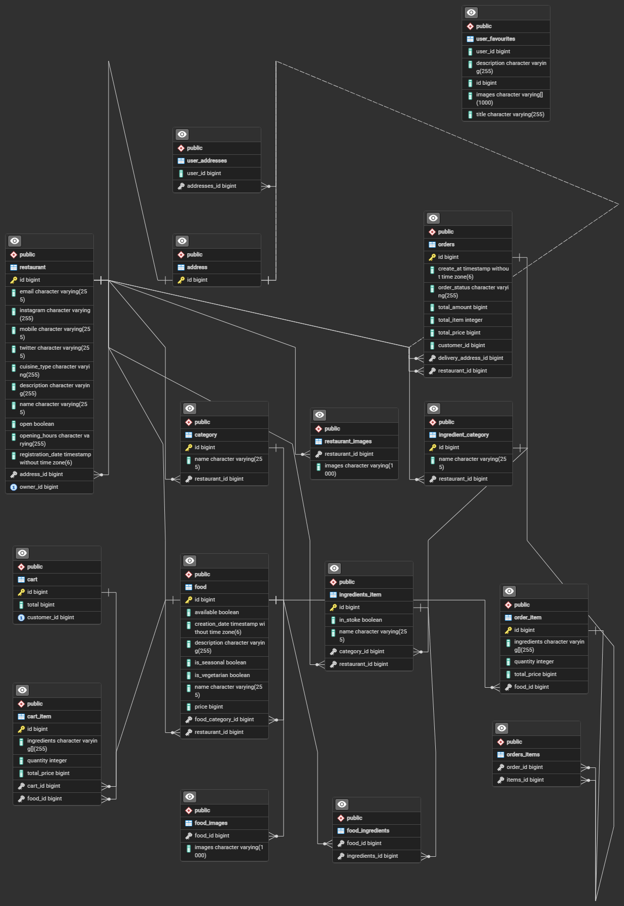

# Documentation API Rest food-ordering
## Description of the project

- Spring boot
- spring security
- spring start mail
- jeson web token
- Posgresql (Data base)

## Web Site de pedidos de comida online
 Food-Ordering es una plataforma para publicar restaurantes, el propietario que quiera incorporarse deberá loguearse.
 Desde la plataforma se puede elegir el horario de apertura para ofrecer menues a domicilio a traves de un servicio de delivery. 
 Al ingresar a un restaurant abierto puedo consultar cada menú y filtrarlos por categoria. Se muestran las imagenes del restaurant, se puede consultar su ubicacion, horario y agregar nuevos restaurantes a tu lista de favoritos.
 Se puede filtrar si el restaurant tiene determinado menúes disponible o elegir los ingredientes disponibles en stock, 
 Al elegir el menú debemos agregarlo al carrito de compras (cart) y elegir su cantidad .
 Al solicitar el pedido ingresa direccion, pin-code y ciudad y se nos redirige a la pagina de pasarela de pago para finalizar el pago.
 Desde el administrador se dan de alta los restaurants y nos permite ver los detalles, agregar y modificarlos.

 

